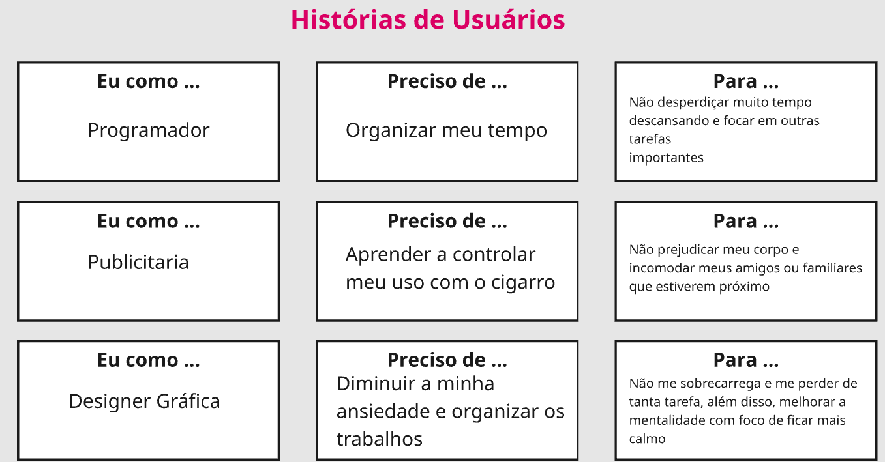
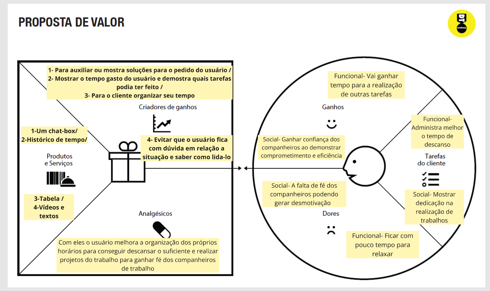

# Product design

Pré-requisitos: <a href="02-Product-discovery.md"> Product discovery</a>

## História dos usuários 
Com base na análise das personas, foram identificadas as seguintes histórias de usuários:

 

> **Links úteis**:
> - [Histórias de usuários com exemplos e template](https://www.atlassian.com/br/agile/project-management/user-stories)
> - [Como escrever boas histórias de usuário (user stories)](https://medium.com/vertice/como-escrever-boas-users-stories-hist%C3%B3rias-de-usu%C3%A1rios-b29c75043fac)
> - [User stories: requisitos que humanos entendem](https://www.luiztools.com.br/post/user-stories-descricao-de-requisitos-que-humanos-entendem/)
> - [Histórias de usuários: mais exemplos](https://www.reqview.com/doc/user-stories-example.html)
> - [9 common user story mistakes](https://airfocus.com/blog/user-story-mistakes/)

## Proposta de Valor
**✳️✳️✳️ APRESENTE O DIAGRAMA DA PROPOSTA DE VALOR PARA CADA PERSONA ✳️✳️✳️**

<strong>Luiz Amaral</strong>
 

<strong>Luana Vieira</strong>

<strong>Ana Costa</strong>

 

> **Links úteis**:
> - [O que é o canvas da proposta de valor e como usar?](https://www.youtube.com/watch?v=Iqb-8Q_eiiA)

## Requisitos 

As tabelas a seguir apresentam os requisitos funcionais e não funcionais que detalham o escopo do projeto. Para determinar a prioridade dos requisitos, aplique uma técnica de priorização e detalhe como essa técnica foi aplicada.

### Requisitos funcionais

• - O usuário pode criar uma conta.

• - O usuário pode registrar o progresso diário (dias sóbrio).

• - O sistema envia notificações motivacionais.

• - O usuário pode acessar vídeos e conteúdos educativos.

• - O sistema permite contato com profissionais de saúde (ex: psicólogos, terapeutas).

• - O sistema envia tarefas e desafios diários para motivação e disciplina.

### Requisitos não funcionais

• - O sistema deve estar disponível 24 horas por dia, 7 dias por semana.

• - A interface deve ser simples, acessível e intuitiva.

> **Links úteis**:
> - [O que são requisitos funcionais e requisitos não funcionais?](https://codificar.com.br/requisitos-funcionais-nao-funcionais/)
> - [Entenda o que são requisitos de software, a diferença entre requisito funcional e não funcional, e como identificar e documentar cada um deles](https://analisederequisitos.com.br/requisitos-funcionais-e-requisitos-nao-funcionais-o-que-sao/)

## Restrições

Enumere as restrições à sua solução. Lembre-se de que as restrições geralmente limitam a solução candidata.

O projeto está restrito aos itens apresentados na tabela a seguir.

• - O projeto deverá ser entregue até o final do semestre 

• - Não é permitido o desenvolvimento de um módulo de back-end  

• - Os dados dos usuários devem ser armazenados com segurança e privacidade.

• - O site/app deve ser responsivo (compatível com dispositivos móveis e desktops).
