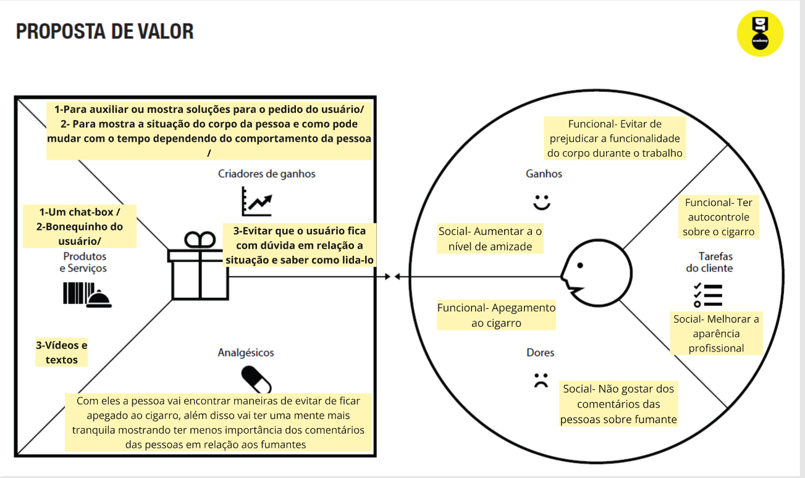
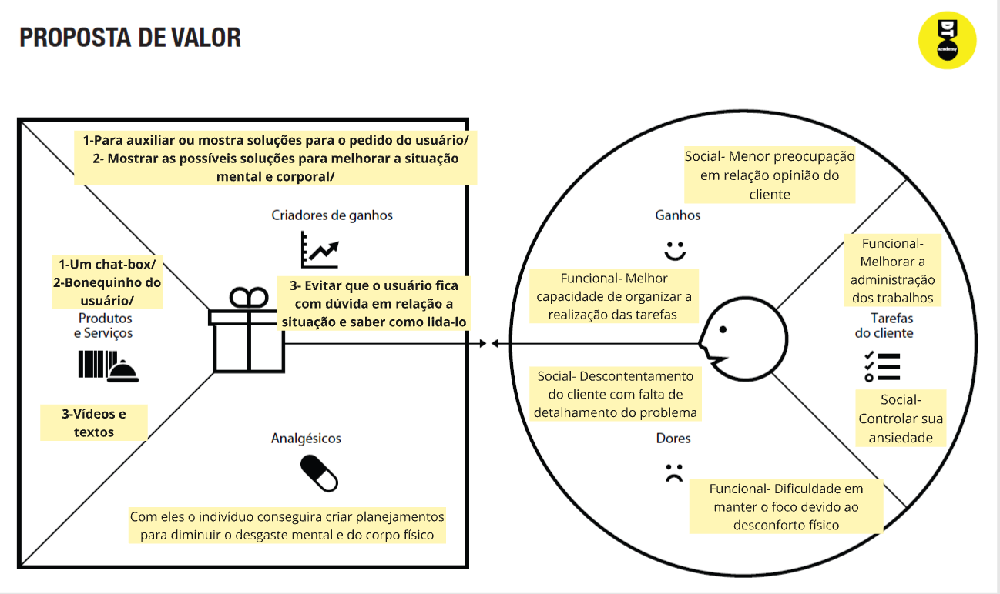

# Product design

Pré-requisitos: <a href="02-Product-discovery.md"> Product discovery</a>

# História dos usuários 

 

# Proposta de Valor

<strong>Luiz Amaral</strong>
 

<strong>Luana Vieira</strong>

<strong>Ana Costa</strong>

 

# Requisitos de Projeto

<strong>A)	Requisitos Funcionais (o que o sistema faz)</strong>

• - O usuário pode criar uma conta.

• - O usuário pode registrar o progresso diário (dias sóbrio).

• - O sistema envia notificações motivacionais.

• - O usuário pode acessar vídeos e conteúdos educativos.

• - O sistema permite contato com profissionais de saúde (ex: psicólogos, terapeutas).

• - O sistema envia tarefas e desafios diários para motivação e disciplina.

<strong>B)	Requisitos Não Funcionais (qualidade, desempenho, segurança)</strong>

• - O sistema deve estar disponível 24 horas por dia, 7 dias por semana.

• - A interface deve ser simples, acessível e intuitiva.

• - Os dados dos usuários devem ser armazenados com segurança e privacidade.

• - O site/app deve ser responsivo (compatível com dispositivos móveis e desktops).

• - O sistema deve ser atualizado semanalmente com novos conteúdos e melhorias.
