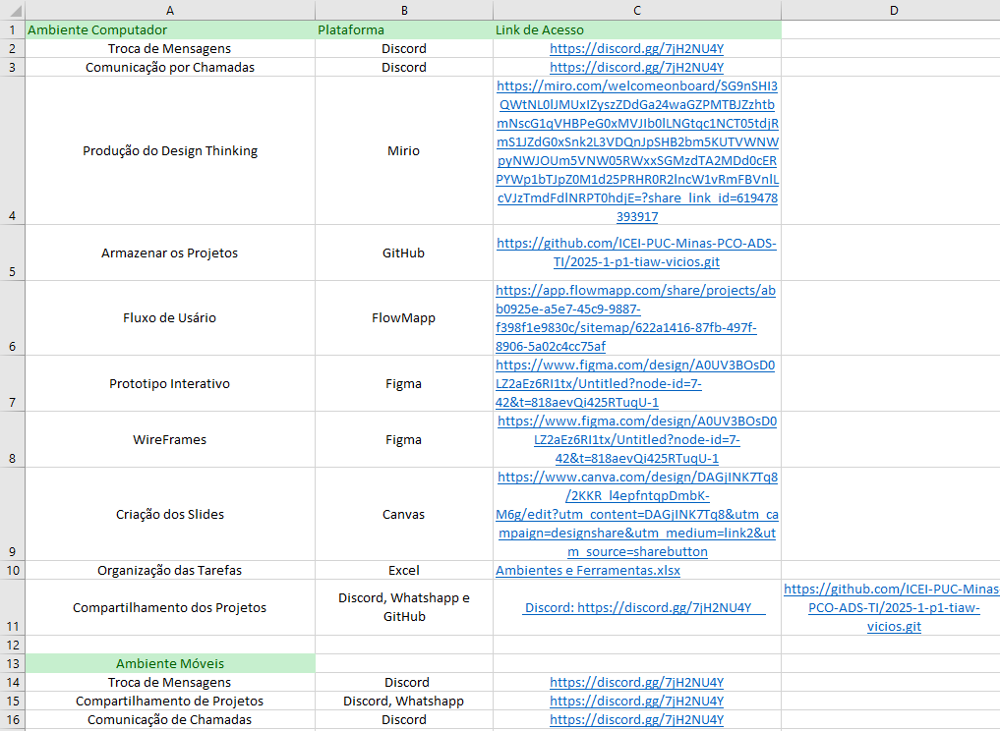
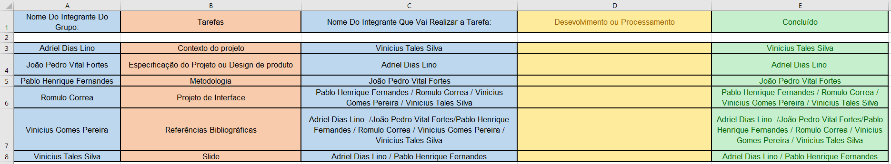

# Metodologia

Pré-requisitos: <a href="03-Product-design.md"> Product design</a>

Descreva aqui a metodologia de trabalho do grupo para abordar o problema. Inclua definições sobre os ambientes de trabalho utilizados pela equipe para desenvolver o projeto. Isso abrange a relação dos ambientes utilizados, a estrutura para a gestão do código-fonte, além da definição do processo e das ferramentas por meio dos quais a equipe se organiza (gestão de equipes).

 ## Relação de ambientes de trabalho

Os artefatos do projeto são desenvolvidos a partir de diversas plataformas. A relação dos ambientes com seus respectivos propósitos deverá ser apresentada em uma tabela que especifique e detalhe Ambiente, Plataforma e Link de Acesso. Defina também os ambientes e frameworks que serão utilizados no desenvolvimento de aplicações móveis.

 
## Controle de versão

A ferramenta de controle de versão adotada no projeto foi o [Git](https://git-scm.com/), sendo que o [GitHub](https://github.com) foi utilizado para hospedagem do repositório.

O projeto segue a seguinte convenção para o nome de branches:

- `main`: versão estável já testada do software
- `unstable`: versão já testada do software, porém instável
- `testing`: versão em testes do software
- `dev`: versão de desenvolvimento do software

Quanto à gerência de issues, o projeto adota a seguinte convenção para etiquetas:

- `documentation`: melhorias ou acréscimos à documentação
- `bug`: uma funcionalidade encontra-se com problemas
- `enhancement`: uma funcionalidade precisa ser melhorada
- `feature`: uma nova funcionalidade precisa ser introduzida

<strong>Organização da equipe e divisão de papeis:</strong>
Para garantir melhor desenvolvimento do nosso site, vamos utilizar a metodologia ágil e flexível do Scrum, pois com a flexibilidade será garantido um atendimento as diversas necessidades do usuário com o decorrer do projeto e a agilidade possibilitara respostas rápidas para possíveis dificuldades ou mudanças do cliente.

Na gestão das ferramentas de versionamento do projeto, foram utilizados dois tipos principais de branches: o branch principal (main), responsável por armazenar as versões estáveis e finalizadas do projeto, e branches secundários (unstable, testing e dev), nos quais os membros da equipe desenvolveram novas funcionalidades e realizaram testes. Após a validação das alterações, os conteúdos dessas branches secundárias foram integrados à main por meio de merges, garantindo que apenas versões revisadas e funcionais fossem incorporadas ao projeto final.
Os commits foram utilizados de forma estratégica para registrar o progresso das tarefas realizadas por cada membro da equipe. Eles foram feitos principalmente nas branches secundárias, sempre com mensagens claras e objetivas que descreveram as mudanças implementadas, o que contribuiu para um histórico de desenvolvimento bem documentado.

A gestão de tags também desempenhou um papel importante, sendo utilizada para marcar versões específicas do projeto que exigiram atualizações e testes antes de se tornarem estáveis. Isso facilitou o controle das versões e o acompanhamento das melhorias implementadas ao longo do tempo.

As mesclagens foram essenciais para consolidar os arquivos e funcionalidades desenvolvidas nas filiais secundárias, integrando-as ao ramo principal de forma organizada e segura. A gestão de questões foi fundamental para o bom andamento do projeto. Cada tarefa, sugestão de melhoria ou problema identificado foi registrada como uma questão no repositório, com especificações claras e responsabilidades. Além disso, o uso de etiquetas como bug, aprimoramento, recurso e documentação auxilia na categorização e priorização das atividades, tornando o fluxo de trabalho mais eficiente e colaborativo.

> **Links úteis**:
> - [Tutorial GitHub](https://guides.github.com/activities/hello-world/)
> - [Git e GitHub](https://www.youtube.com/playlist?list=PLHz_AreHm4dm7ZULPAmadvNhH6vk9oNZA)
> - [Comparando fluxos de trabalho](https://www.atlassian.com/br/git/tutorials/comparing-workflows)
> - [Understanding the GitHub flow](https://guides.github.com/introduction/flow/)
> - [The gitflow workflow - in less than 5 mins](https://www.youtube.com/watch?v=1SXpE08hvGs)

## Planejamento do projeto

### Divisão de papéis

•	<strong>Scrum Master:</strong> João Pedro Vital Fortes 

•	<strong>Product Owner:</strong> Vinicius Gomes Pereira

•	<strong>Equipe de Desenvolvimento:</strong>  Adriel Dias Lino /João Pedro Vital Fortes / Pablo Henrique Fernandes / Romulo Correa / Vinicius Gomes Pereira / Vinicius Tales Silva   

•	<strong>Equipe de Design:</strong> Pablo Henrique Fernandes / Romulo Correa / Vinicius Gomes Pereira / Vinicius Tales Silva

> **Links úteis**:
> - [11 passos essenciais para implantar Scrum no seu projeto](https://mindmaster.com.br/scrum-11-passos/)
> - [Scrum em 9 minutos](https://www.youtube.com/watch?v=XfvQWnRgxG0)
> - [Os papéis do Scrum e a verdade sobre cargos nessa técnica](https://www.atlassian.com/br/agile/scrum/roles)

### Processo

 <strong>Processo de Design Thinking:</strong>
No desenvolvimento do projeto, o grupo utilizou o processo de Design Thinking para estruturar as ideias e encontrar soluções criativas para o problema do vício. A primeira etapa foi a iniciação, na qual os integrantes realizaram pesquisas sobre o tema, explorando conteúdos relacionados e analisando os impactos sociais e individuais causados pelo vício. Em seguida, na fase de Product Discovery, foram utilizados mapas mentais e discussões em grupo para identificar causas, consequências e possíveis abordagens de intervenção.
Durante a fase de ideação a solução escolhida foi a criação de um site interativo com o objetivo de ajudar usuários a reduzir comportamentos viciantes. A plataforma teria funcionalidades inspiradas no Duolingo, mas voltadas à saúde mental e bem-estar, incluindo textos educativos, vídeos informativos e um chat-box para dúvidas e suporte. Na etapa de Product Design, foram criados os primeiros esboços da interface, e o grupo utilizou a ferramenta de design chamado Figma para validar a estrutura da plataforma antes da implementação final.

 <strong>Implementação do Framework Scrum:</strong>
Para organizar o desenvolvimento do projeto, o grupo aplicou o framework Scrum. O trabalho foi dividido em sprints, cada uma com metas específicas e tempo determinado para execução. Foram definidos os papéis dentro da equipe: um membro atuou como Scrum Master,sendo o João Pedro Vital, responsável por facilitar o processo e remover impedimentos, enquanto outro assumiu o papel de Product Owner, sendo o Vinicius Gomes, cuidando das funcionalidades e requisitos do produto.
O time utilizou o quadro Kanban para acompanhar o progresso das tarefas, divididas em colunas como “Tarefas”, “Em Progresso” e “Concluído”. Ferramentas como o Discord foram usadas para as reuniões e discussões de planejamento. Ao fim de cada sprint, o grupo realizou revisões e retrospectivas para avaliar o que foi feito e ajustar o andamento do projeto, garantindo a melhoria contínua.

 <strong>GitHub Projects:</strong>
Para o gerenciamento das tarefas, foi utilizado o GitHub Projects, uma ferramenta integrada ao repositório do grupo. Nela, as tarefas foram organizadas em cartões, com descrições claras e responsáveis definidos. Cada cartão representava uma funcionalidade, correção ou atividade, permitindo acompanhar o progresso em tempo real. O uso de etiquetas como em andamento, finalizado e pendente ajudou na visualização do status de cada item.
Além disso, a integração entre o GitHub Projects as gestões de ferramentas e gestões de questões, facilitou o controle de demandas e bugs.

<strong> Quadro de tarefas-Kanban</strong>

<strong>Link do GitHub Projects:</strong> 
https://github.com/ICEI-PUC-Minas-PCO-ADS-TI/2025-1-p1-tiaw-vicios.git

> **Links úteis**:
> - [GitHub Projects - YouTube](https://www.youtube.com/playlist?list=PLiO7XHcmTsldZR93nkTFmmWbCEVF_8F5H)
> - [Planejamento e gestão ágil de projetos](https://pucminas.instructure.com/courses/87878/pages/unidade-2-tema-2-utilizacao-de-ferramentas-para-controle-de-versoes-de-software)
> - [Sobre quadros de projeto](https://docs.github.com/pt/issues/organizing-your-work-with-project-boards/managing-project-boards/about-project-boards)
> - [Project management, made simple](https://github.com/features/project-management/)
> - [Como criar backlogs no GitHub](https://www.youtube.com/watch?v=RXEy6CFu9Hk)
> - [Tutorial slack](https://slack.com/intl/en-br/)

### Ferramentas

<strong>Ferramentas de Comunicação:</strong> Discord e Whatshapp – São ferramentas que muitos usam no dia a dia para conversar, apresenta fácil acesso, possui troca de mensagens rápida e permite criar chamadas de conversa de maneira ágil

<strong>Ferramentas de Trabalho:</strong> Mirio, Figma, Canva, Excel – Muito recomendada para uso profissional, ótima para criar e editar projetos, além disso possui várias funcionalidades tanto para editação, alteração dos arquivos e outras capacidades. 

<strong>Ferramenta de Armazenamento de dados:</strong> GitHub -  Site recomendado para Programadores, é uso obrigatório para realização da tarefa.  

