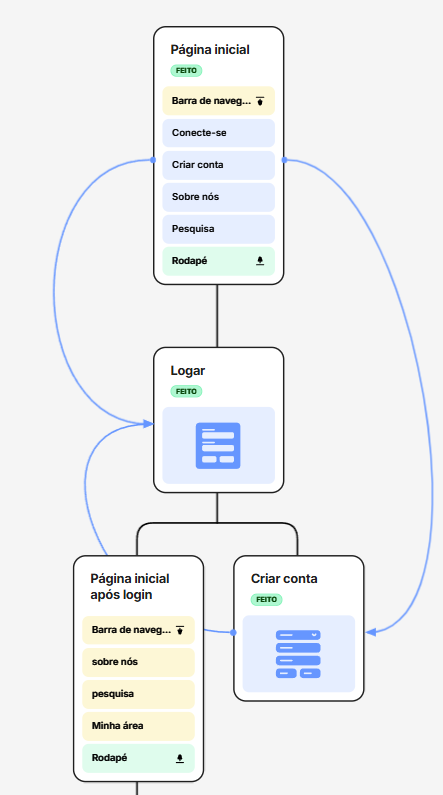
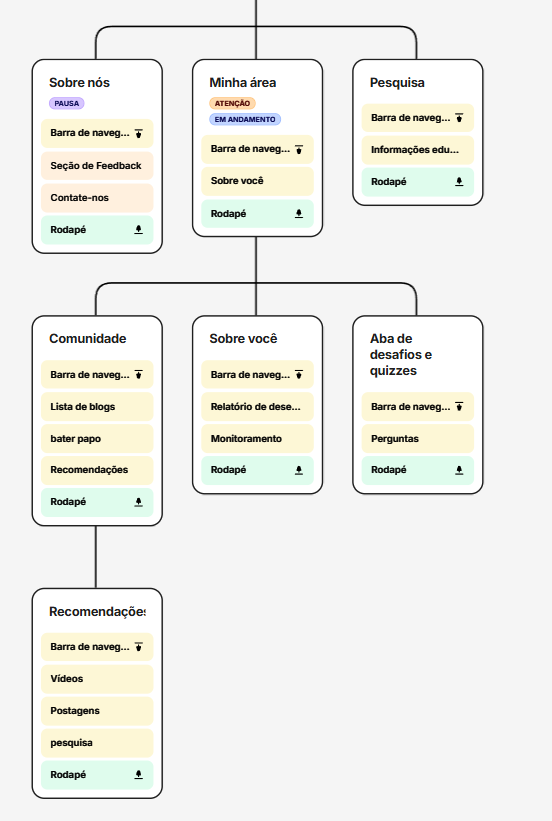
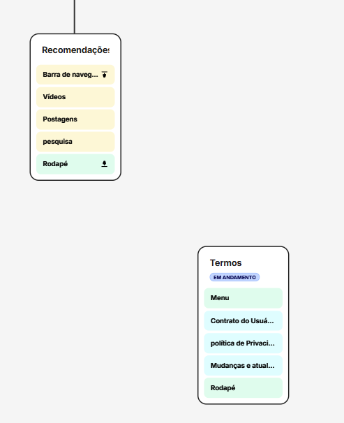
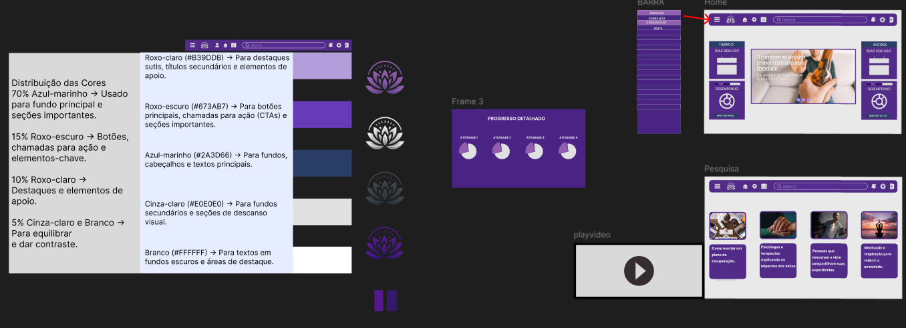
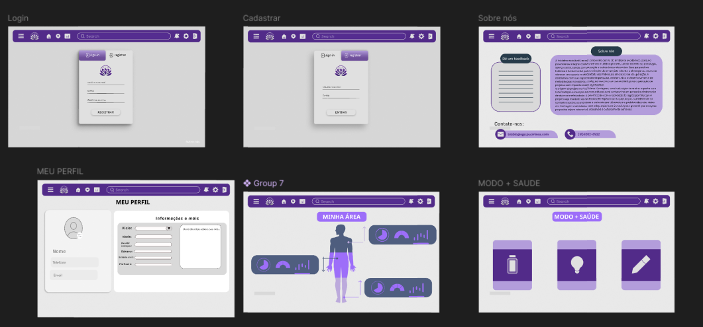
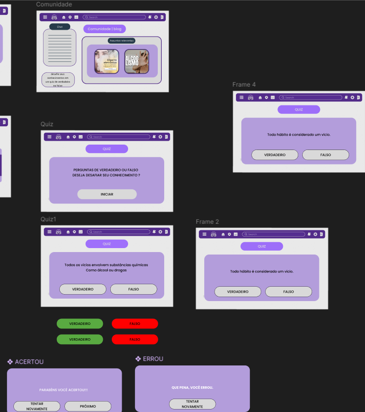

# Projeto de interface

Pré-requisitos: <a href="03-Product-design.md"> product design</a>

 Visão geral da interação do usuário pelas telas do sistema e protótipo interativo das telas com as funcionalidades que fazem parte do sistema (wireframes).

 Apresente as principais interfaces da plataforma. Discuta como ela foi elaborada de forma a atender os requisitos funcionais, não funcionais e histórias de usuário abordados na parte de <a href="03-Product-design.md"> product design</a>.

 ## User flow
 
**✳️✳️✳️ COLOQUE AQUI O USER FLOW ✳️✳️✳️**

Foram separados em três partes para ficar legível

1

2

3

Link:https://app.flowmapp.com/share/projects/abb0925e-a5e7-45c9-9887-f398f1e9830c/sitemap/622a1416-87fb-497f-8906-5a02c4cc75af

> **Links úteis**:
> - [User flow: o quê é e como fazer?](https://medium.com/7bits/fluxo-de-usu%C3%A1rio-user-flow-o-que-%C3%A9-como-fazer-79d965872534)
> - [User flow vs site maps](http://designr.com.br/sitemap-e-user-flow-quais-as-diferencas-e-quando-usar-cada-um/)
> - [Top 25 user flow tools & templates for smooth](https://www.mockplus.com/blog/post/user-flow-tools)

## Wireframes

**✳️✳️✳️ COLOQUE AQUI OS PROTÓTIPOS DE TELAS COM TÍTULO E DESCRIÇÃO ✳️✳️✳️**

1

2

3

Link: https://www.figma.com/design/A0UV3BOsD0LZ2aEz6RI1tx/Untitled?node-id=7-42&t=818aevQi425RTuqU-1

> **Links úteis**:
> - [Protótipos: baixa, média ou alta fidelidade?](https://medium.com/ladies-that-ux-br/prot%C3%B3tipos-baixa-m%C3%A9dia-ou-alta-fidelidade-71d897559135)
> - [Protótipos vs wireframes](https://www.nngroup.com/videos/prototypes-vs-wireframes-ux-projects/)
> - [Ferramentas de wireframes](https://rockcontent.com/blog/wireframes/)
> - [Figma](https://www.figma.com/)
> - [MarvelApp](https://marvelapp.com/developers/documentation/tutorials/)
> - [Adobe XD](https://www.adobe.com/br/products/xd.html#scroll)

### Protótipo Interativo

**✳️✳️✳️ COLOQUE AQUI UM IFRAME COM SEU PROTÓTIPO INTERATIVO ✳️✳️✳️**

1

**Descrição:** O wireframe apresenta a estrutura principal da plataforma de apoio à recuperação de vícios, com telas focadas na visualização de progresso, acesso a conteúdos educativos e motivacionais, e navegação simplificada. A interface é construída com base em uma paleta de cores que prioriza acessibilidade, clareza e cores frias a fim de trazer tranquilidade ao usuário. As principais seções incluem a tela inicial com cards de desempenho, uma área de pesquisa com sugestões de conteúdo, uma visualização de progresso detalhado em formato gráfico e um player de vídeo integrado.

2

3

Link: https://www.figma.com/design/A0UV3BOsD0LZ2aEz6RI1tx/Untitled?node-id=7-42&t=818aevQi425RTuqU-1
